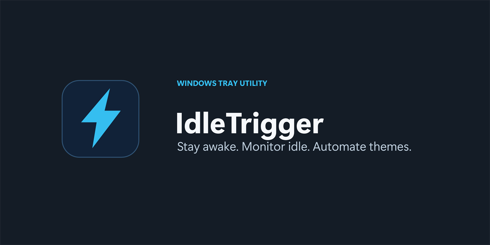
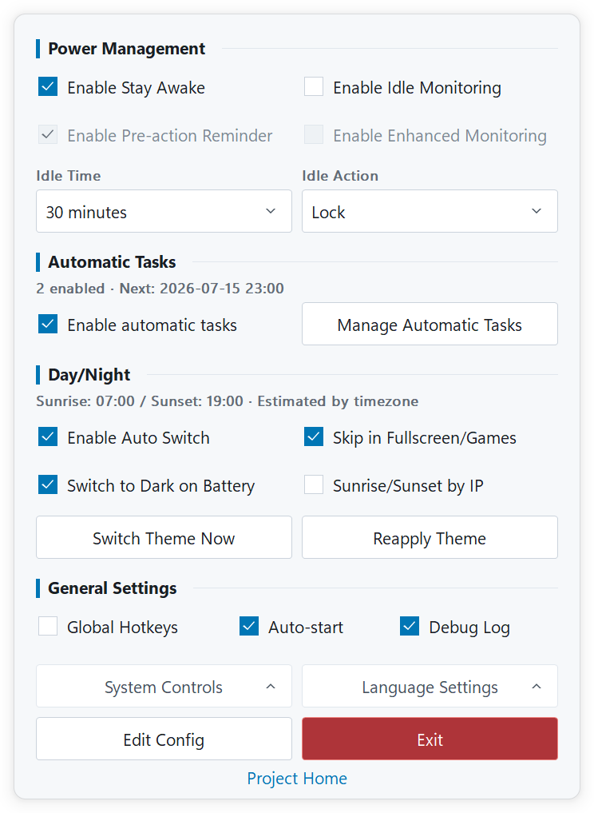

<h1>IdleTrigger</h1>

<strong>Lightweight, native Windows power automation in one portable EXE.</strong>

Keep work running, respond to real input inactivity, and automate power or Windows themes by time and process.

  
  
  
  

  
  
  

  
  

<a href="README.zh-CN.md">简体中文</a>

## ✨ At a Glance

| | Capability | Built for |
| --- | --- | --- |
| ⚡ | **Stay Awake** | Downloads, renders, backups, and remote sessions that must keep running. |
| ⏱️ | **Idle Actions** | Lock, sleep, hibernate, or shut down after real keyboard and mouse inactivity. |
| 🔁 | **Automatic Tasks** | Control power features or run built-in actions by schedule and process state. |
| 🌗 | **Day / Night** | Switch Windows themes by time or sunrise and sunset, with battery and fullscreen options. |

**Small by design:** no installer, service, WebView, simulated input, or extra runtime. Settings stay in a readable TOML file beside the EXE.

## 🪟 Native Control Panel

  <picture>
    <source media="(prefers-color-scheme: dark)" srcset="docs/images/control-panel-en-dark.png">
    
  </picture>

Follows Windows light/dark mode and display DPI. The screenshot follows your GitHub theme.

Left-click the tray icon for everyday settings; advanced options remain in TOML.

## 🚀 Get Started

1. Download **x64** for most PCs, or **x86** for 32-bit Windows.
2. Put the EXE in a writable folder you intend to keep, then run it.
3. Left-click the IdleTrigger tray icon and choose your settings.

Requires **Windows 10 / Windows Server 2016 or later**. No installation is needed.

## 📚 Documentation

| | Read this |
| --- | --- |
| 🧭 | [User guide](docs/user-guide.md) — features, automatic tasks, configuration, CLI, and updates |
| 📝 | [Configuration reference](IdleTrigger.example.toml) — every TOML field in English and Chinese |
| 🛠️ | [Build and development](docs/development.md) — local builds, checks, resources, and release process |
| 🗂️ | [Documentation index](docs/README.md) — all project documents in one place |

## 🤝 Credits

Tray integration is adapted from [getlantern/systray v1.2.2](https://github.com/getlantern/systray) ([Apache-2.0 notice](internal/ui/trayicon/LICENSE)). Built with [BurntSushi/toml](https://github.com/BurntSushi/toml) and [golang.org/x/sys](https://pkg.go.dev/golang.org/x/sys). Stay Awake was inspired by [NoSleep](https://github.com/CHerSun/NoSleep).

## 📄 License

[MIT](LICENSE)
