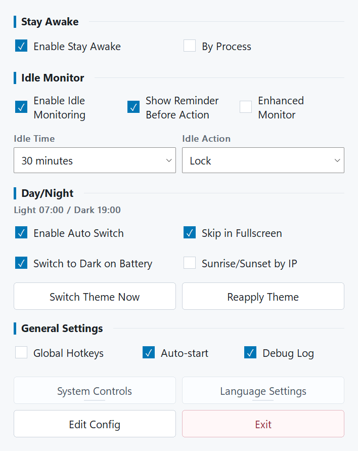
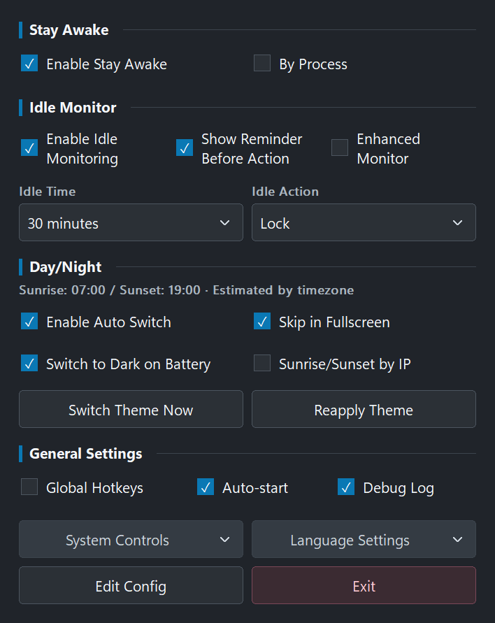
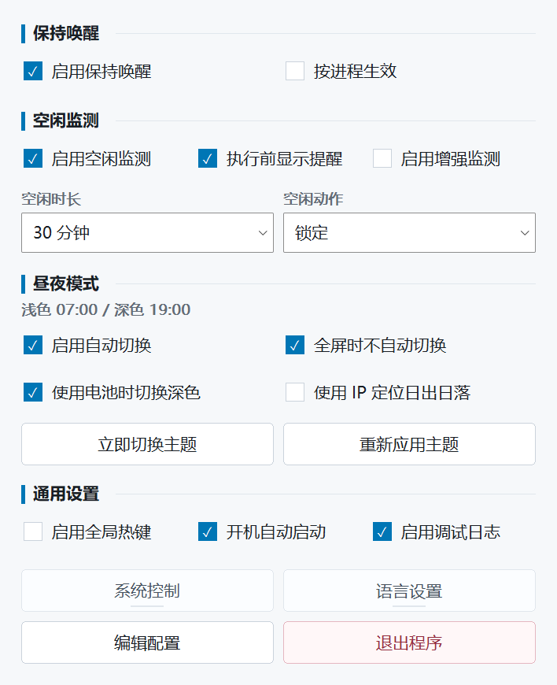
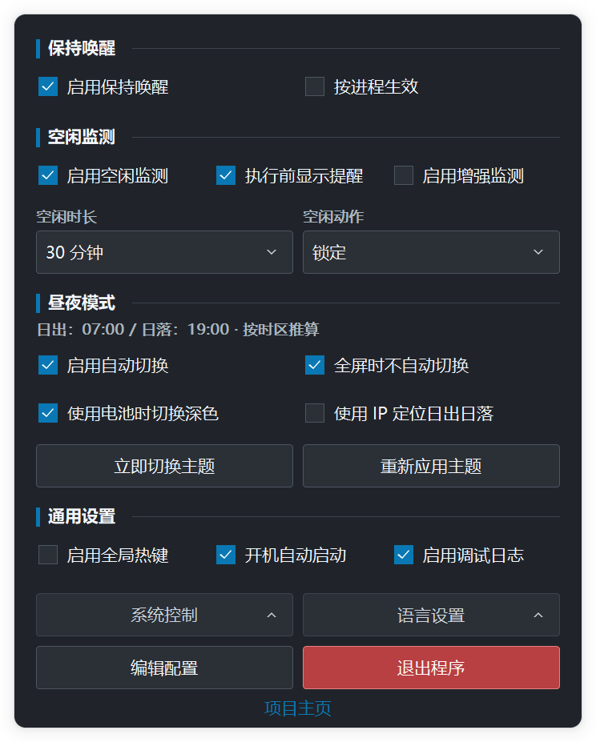

# IdleTrigger

[简体中文](README.zh-CN.md)

**A lightweight Windows tray utility for idle actions, stay-awake control, and scheduled theme switching.**

IdleTrigger is a single executable with no runtime dependencies beyond Windows system DLLs. It stays out of the way in the notification area and keeps its settings in a readable TOML file beside the executable.

## What It Does

- **Idle monitor**: after a chosen period without keyboard or mouse input, lock, sleep, hibernate, or shut down the PC.
- **Pre-action reminder**: show a non-activating reminder before an idle action; mouse or keyboard input, or closing the reminder, cancels the pending action.
- **Stay Awake**: prevent automatic sleep, optionally keeping the display on.
- **Day/Night theme**: switch Windows themes at fixed times or from calculated sunrise and sunset; optionally use dark mode on battery.
- **System controls**: lock, sleep, hibernate, shut down, or restart from the control panel or command line.
- **Automation**: control a running tray instance through a per-session named pipe.

## Requirements

- Windows 10 / Windows Server 2016 or later
- x64 build for most PCs; x86 build for 32-bit Windows
- Theme switching requires Windows Personalize settings. It may be unavailable on Server Core or policy-managed desktops.

Windows 7 is intentionally not supported by the main build. See [development guide](docs/development.md) for the compatibility rationale.

## Quick Start

1. Download `IdleTrigger-x64.exe` from [Releases](https://github.com/JeffioZ/idletrigger/releases).
2. Run it. The app appears in the notification area without opening a main window.
3. Left-click the tray icon to open or close the control panel. Right-click it for the native **Open** and **Exit** menu.
4. Use the panel for common settings; edit `IdleTrigger.toml` beside the EXE for advanced settings.

The control panel follows Windows light/dark mode, responds to DPI changes, and stays open until you close it or left-click the tray icon again. Tooltips explain each available option.

## Using the Control Panel

- Blue controls are enabled or selected; neutral controls are available but not selected. **Exit** is red because it stops all IdleTrigger features.
- Hover **System Controls** or **Language Settings** to open their menus. **System Controls** run immediately; save your work before choosing Sleep, Hibernate, Shut Down, or Restart.
- Use the mouse or `Tab` / `Shift+Tab` to move between controls, then press `Space` to activate the focused control. The keyboard focus has a visible outline.
- The compact panel exposes routine choices only. Use **Edit Config** for advanced settings such as applicable processes, locations, and detailed theme rules.

## Screenshots



<details>
<summary>More themes and languages</summary>

| English dark | Simplified Chinese light | Simplified Chinese dark |
| --- | --- | --- |
|  |  |  |

</details>

## Idle Monitor

The idle monitor is enabled by default with a 30-minute idle time and Sleep as its action. Available panel idle-time choices are:

`1, 2, 3, 5, 10, 15, 30 minutes; 1, 2, 5 hours`.

The monitor uses Windows `GetLastInputInfo` to observe real keyboard and mouse activity. A newly started or re-enabled monitor begins a fresh idle window; it never acts immediately because the machine had already been idle before IdleTrigger started. After an action is triggered, the idle window is reset before monitoring continues.

Enable **Show Reminder Before Action** to receive a non-activating prompt before the action. Any keyboard or mouse input cancels the pending action; closing the prompt does the same. Set `idle_warning_seconds = 0` for silent operation.

If a device, driver, or app refreshes Windows idle time at a fixed interval and prevents system sleep or idle actions, enable the Enhanced Idle Monitor switch. It is off by default; when enabled, IdleTrigger first logs and learns a stable reset pattern, then keeps a more robust idle timer. Normal keyboard or mouse input still resets idle time, and logs continue to record why each reset was accepted or ignored.

## Command Line

Run the EXE without arguments to launch the tray app.

```text
IdleTrigger sleep | hibernate | shutdown | restart | lock

IdleTrigger nosleep on [--screen]
IdleTrigger nosleep off | toggle | status

IdleTrigger monitor on | off | status

IdleTrigger autostart enable | disable | status
IdleTrigger config:reload
IdleTrigger status
IdleTrigger version
```

Commands that change `nosleep` or `monitor` state, plus `config:reload`, forward to the active tray instance through `\\.\pipe\IdleTrigger-<session>` and require the tray app to be running. Status queries still return a result when the tray app is not running. One-shot power actions execute directly.

## Configuration

IdleTrigger creates and maintains `IdleTrigger.toml` next to the EXE. It adds missing keys and refreshed comments when the bundled configuration template changes, while retaining valid existing values. It does not rewrite the file on every run.

Use [IdleTrigger.example.toml](IdleTrigger.example.toml) as the complete, bilingual field reference. Saved changes apply automatically within a few seconds. To apply a change immediately, restart IdleTrigger or run:

```powershell
.\IdleTrigger-x64.exe config:reload
```

Auto-start is stored in the current user's Windows Run registry key and is managed by the panel or CLI, not TOML.

## Logging

Enable **Debug Log** in the panel or set `logging_enabled = true`. The log is written next to the EXE, with `%TEMP%` as a fallback. It rotates at 5 MiB and retains one previous file as `IdleTrigger.log.1`.

Each line includes a startup session identifier, making separate runs easy to distinguish:

```text
[2026-07-11 12:34:56.789] [session:18a0f0-2b4c] Idle monitor started
```

## Build and Development

See [development guide](docs/development.md) for prerequisites, dual-architecture builds, resource generation, and verification commands.

## Project Layout

```text
cmd/idletrigger/            Application entry point and generated Windows resources
build/windows/              Manifest and checked-in application/tray icons
docs/                       Development guide, roadmap, and README screenshots
internal/app/               Serialized application state and feature coordination
internal/feature/           Idle, keep-awake, process-watch, and theme features
internal/ui/                Control panel, idle warning, tray icon, and UI primitives
internal/platform/windows/  Native Windows integrations and system operations
internal/config/            TOML load, validation, migration, and atomic save
internal/devtools/          Build-tagged diagnostics and screenshot support
tools/                      Checks, generators, and screenshot automation
```

## Acknowledgments

- [getlantern/systray](https://github.com/getlantern/systray): local Windows tray implementation derived from v1.2.2 and adapted for IdleTrigger (Apache-2.0)
- [BurntSushi/toml](https://github.com/BurntSushi/toml): TOML parser
- [golang.org/x/sys](https://pkg.go.dev/golang.org/x/sys): Windows API bindings
- [NoSleep](https://github.com/CHerSun/NoSleep): inspiration for the Stay Awake feature

## License

MIT
