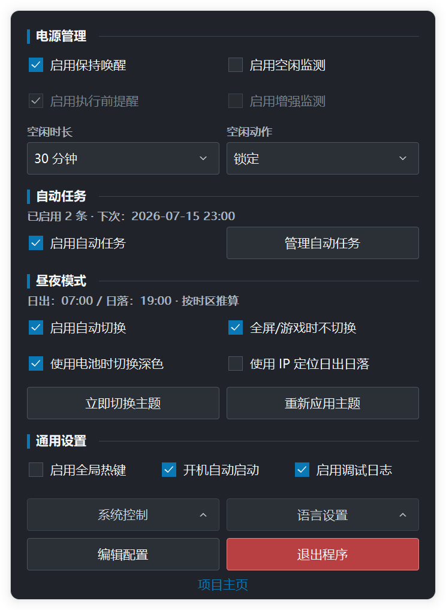
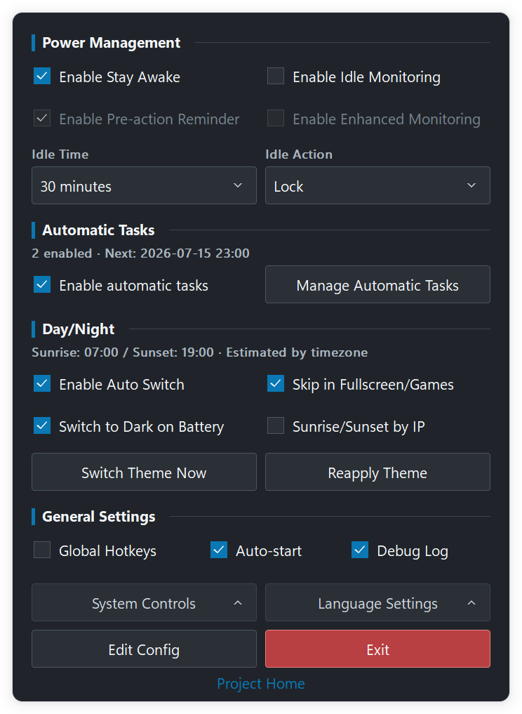

# IdleTrigger

[English](README.md)

**轻量级 Windows 托盘工具：空闲动作、自动任务、保持唤醒和昼夜主题切换。**

IdleTrigger 是一个仅依赖 Windows 系统 DLL 的单文件程序。它驻留在通知区域，常用设置在浮层中完成，完整配置保存在 EXE 同目录的可读 TOML 文件中。

## 能做什么

- **空闲监测**：键盘、鼠标无操作达到设定时长后，锁定、睡眠、休眠或关机。
- **执行前提醒**：动作前显示不抢焦点的提醒；移动鼠标、按任意键或关闭提醒即可取消本次动作。
- **保持唤醒**：阻止系统自动睡眠，并可选保持屏幕常亮。
- **自动任务**：将时间段、单次/每天/每周计划或进程条件，与适用的内置功能组合使用。
- **昼夜模式**：按固定时间或日出日落切换 Windows 深浅色主题；可选电池供电时使用深色，并在全屏应用、演示或前台游戏运行时暂缓切换。
- **系统控制**：从浮层或命令行执行锁定、睡眠、休眠、关机、重启。
- **运行实例控制**：通过当前会话的命名管道控制已运行的托盘实例。

## 系统要求

- Windows 10 / Windows Server 2016 及以上
- 大多数电脑使用 x64 构建；32 位 Windows 使用 x86 构建
- 昼夜主题依赖 Windows 个性化设置；Server Core 或被策略管理的桌面可能不可用

主构建不支持 Windows 7，兼容性原因见 [构建与开发指南](docs/development.zh-CN.md)。

## 快速开始

1. 从 [Releases](https://github.com/JeffioZ/idletrigger/releases) 下载 `IdleTrigger-x64.exe`。
2. 双击运行，程序会驻留在通知区域，不显示主窗口。
3. 左键托盘图标打开或关闭浮层；右键使用原生的“打开”和“退出”菜单。
4. 常用设置在浮层中完成；高级设置可编辑 EXE 同目录的 `IdleTrigger.toml`。

浮层会跟随 Windows 深浅色和 DPI 变化，直到手动关闭或再次左键托盘图标才会收起。每项功能入口均有 tooltip 说明。

## 使用控制浮层

- 蓝色表示已启用或已选中；中性色表示可用但未选中。“退出”为红色，因为它会停止 IdleTrigger 的全部功能。
- 悬停“系统控制”或“语言设置”即可展开对应菜单。“系统控制”会立即执行；选择睡眠、休眠、关机或重启前，请先保存工作。
- 可使用鼠标，或按 `Tab` / `Shift+Tab` 在控件间移动，再按 `Space` 激活当前控件；键盘焦点会显示清晰的轮廓。
- “电源管理”集中放置保持唤醒、空闲监测及其相关设置。两个主开关显示手动配置；自动任务临时接管时不会改写开关，悬停可同时查看手动设置和当前运行状态。
- “自动任务”是独立区块，会显示已启用任务数和下次计划时间。可在主界面直接启用或暂停全部任务，也可点击“管理自动任务”管理规则和选择进程，无需编辑 TOML；暂停不会删除规则。管理窗口打开期间控制浮层会暂时不可操作，关闭后恢复。位置和详细主题规则等高级设置仍通过“编辑配置”处理。

## 界面截图


<details>
<summary>更多主题与语言</summary>

| 简体中文深色 | 英文浅色 | 英文深色 |
| --- | --- | --- |
|  |  |  |

</details>

## 空闲监测

默认启用空闲监测，空闲时长为 30 分钟，动作为睡眠。浮层可选时长为：

`1、2、3、5、10、15、30 分钟；1、2、5 小时`。

空闲监测通过 Windows `GetLastInputInfo` 识别真实键盘和鼠标操作。程序刚启动、重新启用监测时会从新的空闲窗口开始，不会因为启动前系统已经空闲而立刻执行。动作触发后会先重置空闲窗口，再继续监测。

“启用执行前提醒”开关打开后，动作前会显示不抢焦点的提示。鼠标、键盘操作或关闭提示都会取消本次动作；将 `idle_warning_seconds` 设为 `0` 可完全静默执行。

如果设备、驱动或应用让 Windows 空闲时间按固定间隔刷新，导致系统睡眠或空闲动作无法触发，可使用“启用增强监测”开关。该开关默认关闭；打开后 IdleTrigger 会先记录并学习稳定周期，再用更稳健的方式累计空闲时间。普通键鼠操作仍会正常重置计时，日志也会记录每次重置被接受或忽略的原因。

## 自动任务

在控制浮层的独立“自动任务”区块打开管理窗口，可新建、编辑、删除、启用或停用规则。空列表会显示创建提示；未选中任务时编辑、删除和启用/停用不可用，删除前会二次确认。任务编辑器按“基本设置、触发条件、执行选项”只显示当前操作真正需要的字段；任务名称带有输入提示，也可留空自动生成；生效星期支持多选以及“工作日”“每天”快捷选择。无效内容会在界面内说明并定位到首个问题字段。管理窗口相对控制浮层采用模态交互，进程选择器再相对任务编辑窗口采用模态交互；关闭任务编辑器会返回任务列表，未保存修改会先确认。状态操作包括启用或暂停保持唤醒、启用或暂停空闲监测；系统操作包括锁定、睡眠、休眠、关机和重启。状态类任务可按进程运行状态或时间段生效；“暂停”只在任务条件满足时临时覆盖对应的手动设置，条件结束后自动解除。系统操作可设为单次、每天、每周、任一所选进程启动时或全部所选进程退出后执行，也可为时间计划额外附加进程条件。

进程选择器会先加载名称、再在后台补充说明，窗口高度受限且列表可滚动，并提供搜索提示及明确的“刷新”“浏览文件”按钮。窗口重新激活且数据已过期时，只刷新进程名称和实例数，并仅为新出现的进程补充说明；当前窗口会话中已成功或失败的说明读取不会反复重试。搜索、排序、勾选和滚动位置会尽量保持；手动“刷新”会执行完整重扫并重试尚未取得的说明。下拉浮层、任务列表、进程列表和当前选择预览共用同一套主题滚动条。可排序的“进程名称、说明、实例数”列表按可执行文件名去重；点击复选框或进程名称都会选择全部同名实例。如需限定具体文件，可通过“浏览文件”选择 Windows EXE；精确文件只显示在当前选择预览中，不会和运行中进程混排。PID 和说明信息都不会作为规则标识保存。

“任一进程启动时”仅在所选进程从一个都没有变为至少一个运行时触发，IdleTrigger 启动时已经在运行的进程不会补触发，其他同名实例随后启动也不会重复触发。进程退出任务会等待所有匹配实例全部退出，并经过 5 秒宽限后再触发；宽限期内的短暂退出或重启不会造成重复动作。进程状态每 5 秒采样一次；如果某个进程完全在两次采样之间启动并退出，可能无法捕获。

进程发现使用 Windows Toolhelp 列表，纯名称匹配不会打开进程。补充说明时，每个进程名最多选择一个可访问实例并只申请 `PROCESS_QUERY_LIMITED_INFORMATION`；精确路径规则也只对待匹配名称申请同等的有限权限。Windows 拒绝读取受保护进程的元数据时，仍可按名称选择。浏览的 EXE 只会校验格式并读取说明，不会被启动。IdleTrigger 不申请调试权限，不读取进程内存、不注入代码、不结束进程，也不会安装服务或创建 Windows 任务计划。

所有自动系统操作都会显示至少 10 秒、可取消的倒计时。多个系统操作同时到期时，确认一项后会清除本轮其余排队动作，不会连续执行。任务仅在 IdleTrigger 运行时生效；Windows 睡眠期间错过的计划时间在唤醒后不会补执行。任务只能调用内置操作；不支持自定义命令、脚本或任意程序启动。手动设置与自动任务请求彼此独立，任务结束不会改写手动开关。

## 命令行

不带参数运行 EXE 即启动托盘程序。

```text
IdleTrigger sleep | hibernate | shutdown | restart | lock

IdleTrigger nosleep on [--screen]
IdleTrigger nosleep off | toggle | status

IdleTrigger monitor on | off | status

IdleTrigger autostart enable | disable | status
IdleTrigger config:reload
IdleTrigger status
IdleTrigger version
```

改变 `nosleep` 或 `monitor` 状态的命令以及 `config:reload` 会通过 `\\.\pipe\IdleTrigger-<session>` 转发给运行中的托盘实例，因此需要先启动托盘程序。状态查询在托盘程序未运行时仍会返回结果；一次性电源动作直接执行。

## 配置

IdleTrigger 会在 EXE 同目录创建并维护 `IdleTrigger.toml`。配置模板更新时，程序会补齐缺失字段、更新说明注释，并保留已有的有效配置值；不会在每次启动时重复改写文件。自动任务规则保存在该 TOML 中；触发记录单独写入 `IdleTrigger.state.json`，日常调度不会反复改写用户设置。

顶层配置的中英文字段说明见 [IdleTrigger.example.toml](IdleTrigger.example.toml)；自动任务表通常由任务管理器创建和维护。保存修改后会在数秒内自动应用；如需立即生效，可重启 IdleTrigger 或运行：

```powershell
.\IdleTrigger-x64.exe config:reload
```

开机自启保存在当前用户的 Windows Run 注册表项中，由浮层或 CLI 管理，不属于 TOML 配置。

## 日志

在浮层开启“调试日志”，或将 `logging_enabled = true`。日志优先写入 EXE 同目录，目录不可写时回退到 `%TEMP%`；文件达到 5 MiB 后轮转，并保留一份 `IdleTrigger.log.1`。

每行日志包含启动会话标识，便于区分不同运行周期：

```text
[2026-07-11 12:34:56.789] [session:18a0f0-2b4c] Idle monitoring started
```

## 构建与开发

前置条件、双架构构建、资源生成和验证命令见 [构建与开发指南](docs/development.zh-CN.md)。

## 项目结构

```text
cmd/idletrigger/            应用入口和生成的 Windows 资源
build/windows/              manifest 与纳入版本控制的应用/托盘图标
docs/                       开发指南、路线图和 README 截图
internal/app/               串行应用状态和功能协调
internal/automation/        自动任务模型、校验与运行状态文件
internal/feature/           空闲、保持唤醒、自动规则和主题功能
internal/ui/                控制浮层、任务/进程窗口、预警与托盘图标
internal/platform/windows/  Windows 原生集成、进程元数据和系统操作
internal/config/            TOML 读取、校验、迁移和原子保存
internal/devtools/          由构建标签控制的诊断和截图支持
tools/                      检查、生成器和截图自动化
```

## 致谢

- [getlantern/systray](https://github.com/getlantern/systray)：Windows 托盘实现，基于 v1.2.2 调整（Apache-2.0）
- [BurntSushi/toml](https://github.com/BurntSushi/toml)：TOML 解析器
- [golang.org/x/sys](https://pkg.go.dev/golang.org/x/sys)：Windows API 绑定
- [NoSleep](https://github.com/CHerSun/NoSleep)：保持唤醒功能的设计灵感来源

## 许可证

MIT
