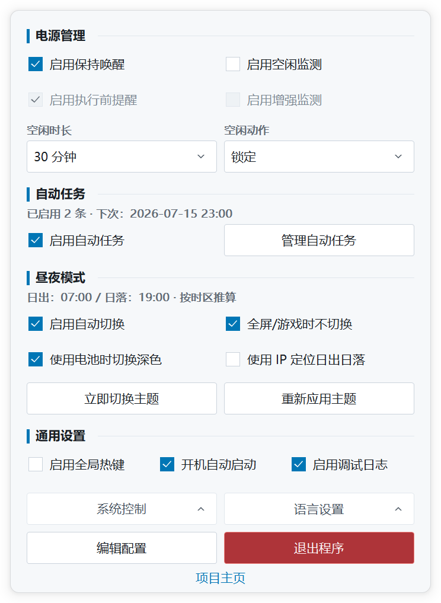

<h1>IdleTrigger</h1>

<strong>轻量、原生的 Windows 电源自动化托盘工具，一个 EXE 即可使用。</strong>

让任务持续运行，在真实输入空闲后执行电源动作， 并按时间或进程自动管理电源状态与 Windows 主题。

  
  
  
  

  
  

<a href="README.md">English</a>

## 🪟 原生控制浮层

  <picture>
    <source media="(prefers-color-scheme: dark)" srcset="docs/images/control-panel-zh-CN-dark.png">
    
  </picture>

跟随 Windows 深浅色与显示器 DPI；截图会随 GitHub 主题切换。

左键托盘图标完成日常设置；高级选项保留在 TOML 中。

## ✨ 核心能力

| | 能力 | 适用场景 |
| --- | --- | --- |
| ⚡ | **保持唤醒** | 下载、渲染、备份或远程连接期间阻止自动睡眠。 |
| ⏱️ | **空闲动作** | 真实键盘、鼠标持续无操作后，自动锁定、睡眠、休眠或关机。 |
| 🔁 | **自动任务** | 按计划或进程状态控制电源功能，也可执行内置系统动作。 |
| 🌗 | **昼夜主题** | 按时间或日出日落切换 Windows 主题，并可适配电池和全屏场景。 |

**为轻量而设计：** IdleTrigger 是面向 Windows 10 / Windows Server 2016 及以上的原生 Win32 便携程序。无需安装器、服务、WebView、模拟输入或额外运行时。设置保存在 EXE 旁边的可读 TOML 文件中。

## 🚀 三步开始

1. 大多数电脑下载 **x64**；32 位 Windows 下载 **x86**。
2. 将 EXE 放入准备长期保留的可写目录，然后运行。
3. 左键 IdleTrigger 托盘图标，完成常用设置。

## 📚 文档

| | 说明 |
| --- | --- |
| 🧭 | [使用指南](docs/user-guide.zh-CN.md)——功能、自动任务、配置、命令行和升级方式 |
| 📝 | [配置参考](IdleTrigger.example.toml)——所有 TOML 字段的中英文说明 |
| 🛠️ | [构建与开发](docs/development.zh-CN.md)——本地构建、检查、资源和发布流程 |
| 🗂️ | [文档索引](docs/README.md)——集中查看项目全部文档 |

## 🤝 致谢

托盘集成基于 [getlantern/systray v1.2.2](https://github.com/getlantern/systray) 调整（[Apache-2.0 声明](internal/ui/trayicon/LICENSE)）。

项目使用 [BurntSushi/toml](https://github.com/BurntSushi/toml) 和 [golang.org/x/sys](https://pkg.go.dev/golang.org/x/sys)；保持唤醒功能受到 [NoSleep](https://github.com/CHerSun/NoSleep) 启发。

## 📄 许可证

[MIT](LICENSE)
